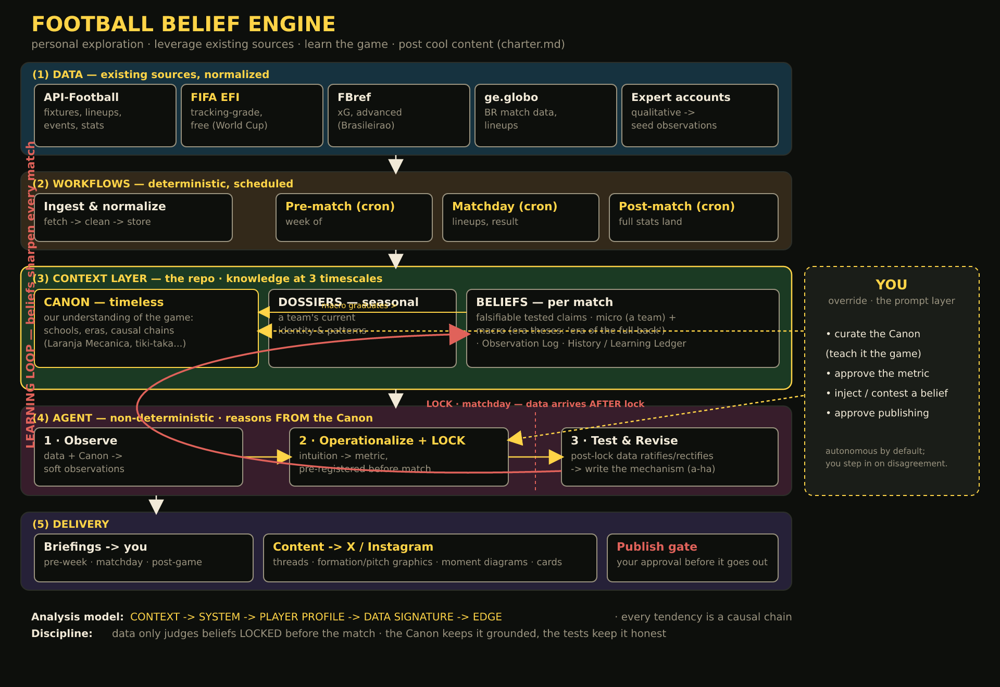

# Architecture

The system reads top-to-bottom; the two highlighted arrows carry the thesis.

## Layers

| # | Layer | Responsibility |
|---|-------|----------------|
| ① | **Data** | External sources, normalized: FBref (xG, advanced), API-Football (fixtures, lineups, events), news RSS (injuries, probable XI) |
| ② | **Workflows** | Deterministic, scheduled: ingestion + the clock triggers (pre-match week / matchday / post-match) |
| ③ | **Context layer** | The repo — the heart, knowledge at 3 timescales: **Canon** (timeless — our understanding of the game, see `canon.md`) · **Team Dossiers** (seasonal) · **Belief Bank** + Observation Log + History/Learning Ledger (per-match) |
| ④ | **Agent** | Non-deterministic: `Observe → Operationalize+LOCK → Test & Revise` |
| ⑤ | **Delivery** | Briefings to you + the **content workflow** (threads, graphics) |

## The two arrows that matter

- **Learning loop** (red, back-edge): `Test & Revise` writes the revision +
  mechanism back into the Belief Bank / Dossiers. This is "gets smarter every
  match." Without it, it's an LLM with amnesia.
- **The 🔒 lock**: matchday data arrives *after* a belief's test is locked.
  This pre-registration is the anti-confirmation-bias guard.

## Where the human sits

**You are the override, not the operator.** The system runs autonomous; you
step in to approve a metric, inject a belief, contest with data, or set scope.
The prompt layer kicks in only on disagreement.

## Open design questions

- Is override-only too hands-off, or exactly the autonomy we want?
- Content-type priority — which formats ship first? (see `content-types.md`)
